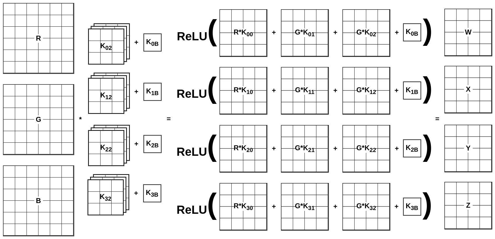

# Convolution and Convolutional Layers
The purpose of this document is to refresh the knowledge of two dimensional (2D) discrete convolution and convolutional layers in convolutional neural networks (CNNs).

## 2D Discrete Convolution
Mathematically 2D discrete convolution is defined by the following equation:
$$
y[i, j] = \sum_{m = −\infty}^{\infty}\sum_{n = −\infty}^{\infty} = h[m, n] \cdot x[i−m,j−n],
$$
where:
* $x$ is the input image matrix,
* $h$ is the convolutional kernel and
* $y$ is the resulting matrix.

With a kernel of size 3 by 3, an image (no padding considered) and a resulting matrix all indexed with $[0, 0]$ in the left upper corner, where the first index specifies row and the second column, will the equation looks as follows:
$$
y[i, j] = \sum_{m = 0}^{2}\sum_{n = 0}^{2} = h[m, n] \cdot x[i+m,j+n].
$$

E.g. for $i=2$ and $j=3$ the equation can be rewritten to:
$$
y[2, 3] =\\
h[0, 0] \cdot x[2, 3] + h[0, 1] \cdot x[2, 4] + h[0, 2] \cdot x[2, 5] +\\
h[1, 0] \cdot x[3, 3] + h[1, 1] \cdot x[3, 4] + h[1, 2] \cdot x[3, 5] +\\
h[2, 0] \cdot x[4, 3] + h[2, 1] \cdot x[4, 4] + h[2, 2] \cdot x[4, 5]. 
$$

## Convolutional Layers
Convolutional layer is typically composed of $C$ channels of an input, which might be 3 matrices for colors (RGB) at the input of the whole network, or any number of matrices inside of the network. Next, every layer has $N$ filters with $K$ kernels (note that $C$ will be always equal to $K$). Last, there is an activation function, which ensures non-linearity and which is applied on the results of a convolution of the input by the filter.

The example in section *2D Discrete Convolution* captures a situation, where the number of channels is $C=1$ and the only filer has 1 kernel, i.e. $N=1$ and $K=1$. The output is therefore a single matrix or 1 channel. The number of output channels is solely given by the number of filters. Meaning, that a convolutional layer with input composed of $C_0=2$ channels and a $N=4$ filters with $K=2 kernels will output 4 channels ($C_1 = 4$), which will be an input to the following layer.

The following example illustrates, how the computation of a typical convolutional layer is performed (with $C=3$ input channels (RGB image), $N=4$ filters each with $K=3$ kernels):

